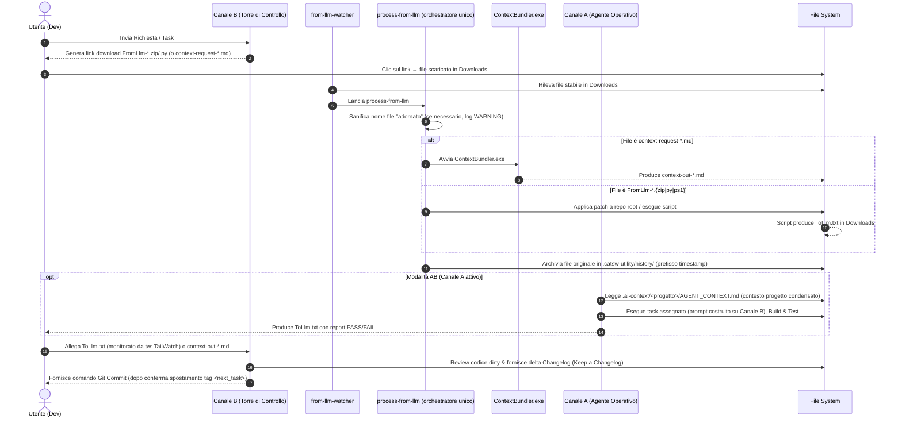
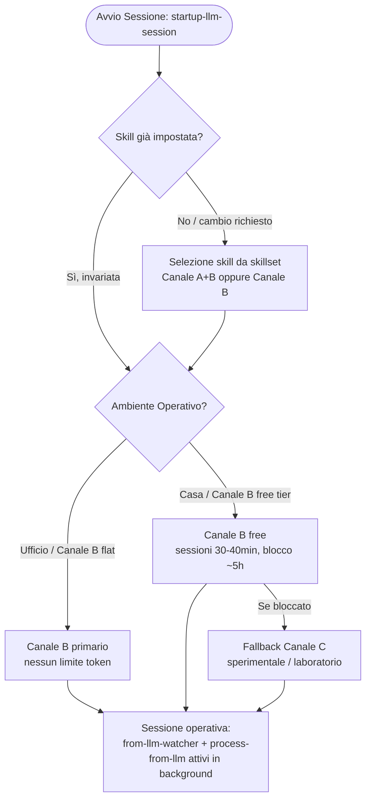

# TurboAI - Governance Agentica Multi-Canale & Automazione Locale

## 1. Obiettivo e Principi Guida

`TurboAI` consente di lavorare in modalità agentica o semiagentica con risorse limitate. Anche avendo a disposizione llm free tier o abbonamenti base con rate-limit severi.
Evolve il flusso agentico a una piattaforma multi-canale agnostica e totalmente segregata. Il principio guida rimane invariato:

> Utilizzo di un canale di assistenza al Governo anche in presenza di un canale FullAgentic, per supervisione, controllo, pianificazione e limitazione dei consumi di badget sui canali costosi/limitati.
> Governare intensamente le decisioni rischiose; eseguire in batch e verificare meccanicamente ciò che è deterministico, reversibile e già autorizzato.

Target principali:
- Gestione flessibile su 3 Canali (A, B, C) per garantire operatività sia in ambiente ad alta capacità (ufficio/flat) sia in mobilità/casa (fallback rate-limit).
- Integrazione completa dei daemon locali: `from-llm-watcher`, `process-from-llm`, `switch-skill` e monitoraggio streaming `tailwatch` su `ToLlm.txt`.
- Totale segregazione AI Act: zero termini agentici in `Documentation/` o nei rilasci ufficiali di prodotto.
- TurboAI nasce per colmare il divario tra le chat LLM gratuite/limitate (senza esecuzione agentica autonoma) e i workflow full-agentic. È uno strumento di transizione: se in futuro modelli full-agentic diventeranno liberamente accessibili senza le restrizioni attuali, gran parte della ragion d'essere di TurboAI verrebbe meno.

### 1.1  Cosa fornisce TurboAI (e cosa no)

TurboAI fornisce l'infrastruttura di orchestrazione: watcher, tool, e la skill che spiega all'LLM cosa ha a disposizione e come interagire con l'utente. Non fornisce - e non può fornire in generale - le regole di dominio del tuo progetto specifico.

Per usarlo su un progetto reale devi aggiungere i tuoi file di governo: markdown che istruiscono l'LLM su stack, convenzioni e best practice che vuoi far rispettare (es. per un progetto .NET: preferenze su `ReadonlySpan<T>`, pattern Result invece di eccezioni, ecc.). Il template incluso è volutamente minimale - il valore aggiunto che ottieni dipende dal dettaglio che ci metti tu.

TurboAI non è "installa e dimentica": le skill vanno riviste quando cambiano i modelli LLM sottostanti, perché comportamenti e istruzioni ottimali possono cambiare da un modello all'altro.

### 1.2 TDM - TurboAI Development Method

TDM è il nome del metodo di sviluppo assistito da AI su cui si basa TurboAI: l'insieme di regole, ruoli e gate che governano come un LLM esegue lavoro reale su un progetto, mantenendo tracciabilità e controllo umano.

Il TDM è definito operativamente dalle sezioni seguenti di questo documento:

- **Canali di esecuzione** (§2): chi fa cosa tra Canale A (agentico), B (chat supervisionata), C (modelli limitati)
- **Classificazione del rischio R1-R4** (§4): quanto controllo richiede un task prima di essere eseguito
- **Gate di governance** (§5): i punti di verifica obbligatori nel ciclo di lavoro

TDM non è un prodotto separato da installare: è la metodologia che i tool di TurboAI (watcher, orchestratore, skill) sono costruiti per far rispettare.

### 1.3 Artefatti di Piano e Contesto

- **SOLUTION_GOVERNANCE.md**: file principale di governo del canale B
- **Plan / Milestone / Task**: il lavoro è strutturato in piani suddivisi in milestone, a loro volta suddivise in task di dimensione contenuta, ciascuno eseguibile in una singola sessione di chat.
- **Agentic-Context**: file di contesto statico per-progetto che riduce il consumo di token del Canale A full-agentic, evitandogli di dover ricostruire da zero la comprensione della solution a ogni sessione.
- **Changelog**: il suo aggiornamento viene tipicamente delegato al Canale C (modelli più leggeri free), per non consumare i token limitati dei Canali B/A su un'attività a basso rischio.
- **Documentazione di progetto**: nei progetti della solution, i documenti markdown in `Documentation/` tipicamente delegati al Canale C (modelli più leggeri free)

Nota: La suddivisione di cosa fare sui canali è fortemente dipendente dalle risorse disponibili all'utente. Quello indicato è nel mio contesto attuale per lo sviluppo dei miei progetti personali con risorse free-tier.
Esempio al 2026-08-09:

- Canale A (full-agentic) : Google Antigravity 2.0 - free-tier con risorse limitate.
- Canale B (chat llm full capabiltiy for TDM use) : Anthropic Claude Sonnet 5.0, SpaceAI Grok 4.5
- Canale C (chat llm with limitation - can't download zip/py/md) : Gemini 3.6 Flash, ... lunga lista di altri modelli.

### 1.4 Curiosità

- il prefisso turbo, almeno nella fase iniziale, corrisponde al suo sviluppo turbo-lento (con modifiche turbinose, turbo-ai viene rivoluzionato a distanza di pochi giorni e -lento perchè lo sviluppo nei fine settimana e tarde serate nei ritagli di tempo, con i fondi di energie residue).
- il sitema turbo-ai è implementato nei laboratori CatSW di Roma su mainframe HAL9000-MK2 per la versione Windows 11 e sono previsti anche test sul server HAL9000 (MK1 del 2009) per i test su future release su Debian 13 (maybe).
- turbo-ai usa tecniche di dogfooding (ogm free).
- turbo-ai entro il 2171 diventerà senziente e salverà il mondo.
- la versione 42 di turbo-ai sarà in grado di svelare la "domanda fondamentale sulla vita, l'universo e tutto quanto" ma in file binario crittografato a prova di sistemi quantici.
- qualcuno afferma che CatSW significhi "Computer Automated Tools & Software Works" a me sembra più software del Caz.o (gatto)
- IK0VCK è il nominativo internazionale dell'operatore Stefano che ha stazione nel suo QRA di Roma ( sia lodata la telegrafia `... . -- .--. .-. .   ... .. .-   .-.. --- -.. .- - .-` )
- In CatSW la serietà è presa nella massima considerazione.

---

## 2. Architettura dei Canali (A, B, C)

`TurboAI` struttura il lavoro su tre canali distinti:

- **Canale A (Piena capacità Agentica autonoma con suo harness) - tipicamente risorse di utilizzo limitate ed a pagamento:**
  - Opera sul codice sorgente C# e sui file di progetto (`.csproj`).
  - Esegue build e unit test locali.
  - Legge e aggiorna lo stato temporaneo in `.ai-context/canale-a/<progetto>/` scrivendo solo il delta del task eseguito in formato https://keepachangelog.com/it-IT/1.1.0/.
  - **Divieti:** Non modifica mai file in `Documentation/`, `Changelog.md` o file di Piano; non committa e non esegue cleanup.

- **Canale B (Chat LLM evoluta - Torre di Controllo Flat / Primary) - risorse di utilizzo limitate o che richiedono pagamento per utilizzo intensivo:**
  - Utilizzato come canale principale ad alta quota/flat.
  - Classifica il rischio (R1-R4), acquisisce il contesto e definisce lo scope.
  - Revisiona il codice in stato *dirty* e i report del Canale A.
  - Applica il frammento Changelog in `Documentation/Changelog.md` ed esegue il commit finale.

- **Canale C (Chat LLM basica - Torre di Controllo Fallback) - non hanno le capability del canale B ma sono gratuite:**
  - Utilizzato da remoto/casa per superare i limiti di quota dei modelli primari sul canale B.
  - Sostituisce il Canale B nelle sessioni limitate, da utilizzare per compiti semplici per non consumare token sul canale B.

Con TurboAI gli scenari tipici sono due:

- Ambito lavorativo: si usa una combinazione di Canale A e B. Si usa il canale A per i compiti più complessi e delicati ed il canale B come ausilio al governo, brainstorming e fallback del canale A per risparmiarne il consumo.
- Ambito personale lo cost: si può lavorare anche senza pagare abbonamenti sfruttando solo Canale B e C. Il canale B (ad esempio Claude Sonnet e Grok) ha la possibilità di utilizzare al 100% TurboAI ma se si usa il free tier ha limitazioni forti di consumo token prima di incorrere in sospensioni di ore prima di poter tornare a lavorare. Chiaramente anche i modelli che si possono scegliere sono limitati rispetto ai tier a pagamento. Il canale C ha capacità limitate e modelli meno performanti del livello B (anche del B free tier) ma si usa per ovviare alle risorse limitate sul canale B, chiaramente se uno ha un abbonamento flat sul canale B il canale C può giusto servire in casi particolari.

---
### 3. Diagrammi

### 3.1 Diagramma di Sequenza Multi-Canale (A - B/C - Watcher)



### 3.2 Diagramma di Flusso della Selezione Skill e Fallback



---

## 4. Classificazione del Rischio (R1 - R4)

- **R1 (Basso rischio, meccanico):** Rename, movimento file, aggiornamento doc. Verifiche: diff e statici.
- **R2 (Rischio medio, refactoring circoscritto):** Estrazione classi, DI locale, utility. Verifiche: build e test mirati.
- **R3 (Alto rischio, comportamento o stato globale):** Auth, middleware, logging globale, DB, contratti. Richiede: assessment B1/C, guardrail, build, test suite e closure audit.
- **R4 (Critico, architetturalmente irreversibile):** Migrazione dati, contratti pubblici, sicurezza. Richiede: tutto R3 + checkpoint umano e rollback esplicito.

---

## 5. I Quattro Gate di Governance

1. **Gate 1 - Preflight:** Verificata pulizia working tree, HEAD, assenza file temporanei e baseline test.
2. **Gate 2 - Piano Operativo:** Definizione rischio (R1-R4), scope positivo/negativo, asserzioni e commit boundary.
3. **Gate 3 - Execution Gate:** Esecuzione in batch della patch, diff, build e test mirati. Stop immediato in caso di errore o deviazione.
4. **Gate 4 - Closure:** Verifiche, Aggiornamento Changelog e dei file in .ai-context di governo, commit gestito dalla Torre di Controllo (B/C).

---

## 6. Conformità AI Act & Segregazione Documentale

- **Zero Riferimenti AI:** `Documentation/`, `Changelog.md` e i `README.md` di prodotto devono rimanere completamente privi di riferimenti ad agenti, prompt o modelli LLM.
- **Ubicazione Metadati:** Tutti i file temporanei e i contesti agentici vivono sotto `.ai-context/`.
- **Esclusione Hash Commit:** Nessun documento tracciato da Git contiene l'hash del commit che lo introduce.

# 7. Standard di Definizione dei Piani di Lavoro (Self-Contained & Token-Optimized)

## 7.0 Modello di Contesto Effettivo (premessa vincolante)

Il vincolo operativo reale è più stretto di un generico "evita di far leggere tutto il piano":

- **Ogni task gira in una chat nuova (reset).**
- **L'LLM esecutore riceve, per default, ESCLUSIVAMENTE il testo racchiuso tra `<next_task>` e `</next_task>`** — non l'Objective, non il Contratto, non i Constraints, non gli altri task, non lo storico dei task già completati.
- L'unico contesto aggiuntivo che l'LLM riceve è ciò che viene esplicitamente allegato alla sessione (file sorgente richiesti, `SOLUTION_GOVERNANCE.md` se lo start-session lo allega di default, eventuali "extra file per task" dichiarati — vedi §7.1.2 punto 6).

Conseguenza diretta: **il testo del singolo task È il piano**, non un suo riassunto. Qualunque informazione non riscritta dentro i delimitatori è, ai fini pratici, persa per l'LLM che esegue quel task — indipendentemente da quanto sia "ovvia" leggendo il file per intero.

## 7.1 Specifiche di Struttura del Piano (Self-Contained Task Framework)

### 7.1.1 Principi Guida per l'Ottimizzazione dei Token

- **Autocontenimento Totale (Closed-Book Execution):** un task deve essere eseguibile leggendo solo il proprio testo delimitato, senza inferenze su Objective/Contratto/Constraints globali o su altri task, completati o meno.
- **Granularità Atomica:** un task non deve essere né troppo generico ("aggiorna tutti i wrapper") né troppo minuto da richiedere 10 sessioni per una modifica banale — deve coincidere con un'unità logica eseguibile in un unico scambio prompt/response.
- **Budget di Ridondanza Mirata:** dato che ogni task riparte da zero, un minimo di duplicazione di contesto tra task è inevitabile e voluto — ma va tenuto mirato: si riporta solo il sottoinsieme di regole/vincoli globali realmente pertinente a QUEL task, in forma compatta, non l'intero Contratto/Constraints ogni volta. Il costo di ridondanza mirata è accettabile; il costo di un task che fallisce per contesto mancante non lo è.
- **Propagazione Esplicita delle Decisioni:** quando un task fissa un valore, un nome di chiave, un path risolto o una convenzione che un task successivo dovrà usare, quel valore deve essere scritto per esteso nel testo del task successivo al momento della chiusura del task corrente — mai lasciato come riferimento implicito ("vedi T5.1", "come deciso sopra"). Se il piano non viene aggiornato a ogni chiusura, il task successivo nasce già rotto.
- **Direttiva di Propagazione (self-flagging):** questo non può dipendere dalla memoria di chi chiude il task. Chi SCRIVE il piano, in fase 3, ha già visione di quali task a valle dipenderanno da un output non ancora noto (tipico dei task di discovery/assessment). Quel task va scritto includendo, nei suoi stessi Acceptance Criteria o Delivery Artifacts, l'istruzione esplicita per l'LLM esecutore di segnalare in modo marcato ogni valore che dovrà essere riportato altrove — es. "se trovi il path cablato, evidenzialo esplicitamente come `PROPAGATE TO T5.2: <valore>`" — così l'output del task stesso guida la chiusura, invece di richiedere che chi chiude ricordi a memoria cosa serviva a valle.
- **No Leakage tra Task:** nessun dettaglio indispensabile per il Task `N` deve stare esclusivamente nel Task `N-1` o `N+1` — se serve, va copiato dentro, non referenziato.

### 7.1.2 Anatomia Obbligatoria di ogni Task nel Piano

```markdown
#### [ID_TASK] - [Titolo Sintetico e Chiaro]

1. Target Paths (Mappa dei File)
   - Elenco ESPLICITO e COMPLETO dei percorsi relativi dei file da creare, modificare o testare.
   - Nessun riferimento generico a "tutti i file" o "i wrapper": solo path esatti.
   - Se il task è di sola discovery/assessment (path non ancora noti), va dichiarato esplicitamente come tale
     e va indicato il punto di partenza della ricerca (es. cartella radice, pattern di ricerca).

2. Context & Dependencies (Contratto Minimo Autosufficiente)
   - Sintesi (poche righe) del SOLO sottoinsieme di regole di business/vincoli globali applicabile a questo task.
   - Qualunque decisione presa in task precedenti da cui questo task dipende (nome chiave di governance,
     path risolto, convenzione adottata) va riscritta qui per intero, non richiamata per riferimento.
   - Eventuali variabili di ambiente, chiavi di configurazione o contratti dati coinvolti.

3. Implementation Scope (Cose da Fare)
   - Elenco puntato delle azioni esatte di refactoring, scrittura o cancellazione codice.

4. Acceptance Criteria (Criteri di Successo)
   - Condizioni oggettive per considerare il task COMPLETATO prima di passare al successivo.
   - Se questo è un task di discovery/assessment da cui dipendono task successivi (§7.1.1 Direttiva di
     Propagazione), includere qui l'obbligo di marcare esplicitamente ogni valore da propagare, es.
     `PROPAGATE TO [ID_TASK]: <valore>`.

5. Delivery Artifacts (Cosa deve produrre l'LLM)
   - Formato dell'output atteso (es. Patch ZIP con script verificatore in `.catsw-utility/temp/`,
     codice completo nei blocchi markdown, o report di assessment).

6. Extra Startup Files (opzionale)
   - Elenco dei file da allegare automaticamente all'avvio sessione per questo specifico task,
     oltre a quelli standard (SOLUTION_GOVERNANCE.md ecc.) — meccanismo dichiarativo per-task,
     non un config globale separato.
```

### 7.1.3 Checklist di Chiusura Task (obbligatoria prima di avanzare `<next_task>`)

Prima di spostare il puntatore `<next_task>` sul task successivo, chi chiude il task corrente deve verificare:

- [ ] Il task successivo ha già Target Paths validi e verificati (non ipotizzati)?
- [ ] Ogni decisione/valore appena fissato in questo task, se rilevante per il successivo, è stato riscritto per esteso nel suo testo?
- [ ] Il task successivo è eseguibile leggendo SOLO il proprio testo, senza aprire il resto del piano?
- [ ] Se il task successivo era uno stub/placeholder, è stato espanso secondo l'Anatomia Obbligatoria (§7.1.2) prima di diventare `<next_task>` attivo?

Un task placeholder (una riga, senza Target Paths/Acceptance Criteria) non deve mai diventare il blocco `<next_task>` attivo così com'è: va prima riscritto secondo §7.1.2.

### 7.1.4 Nota tecnica: il tag `<next_task>` in prosa

Quando il testo del piano deve *menzionare* il tag `<next_task>` (es. nelle istruzioni di resume o nei task che parlano del meccanismo stesso), va scritto in modo che un parser Markdown/HTML non lo interpreti come un tag reale vuoto — altrimenti sparisce dal testo reso. Usare entità (`&lt;next_task&gt;`) o comunque verificare il rendering finale.

## 7.2 Protocollo di Fase Iniziale (Requirements Gathering & Plan Generation)

```
FASE 1: Raccolta Requisiti Tecnico-Funzionali (Input Utente)
              |
              v
FASE 2: Analisi delle Lacune e Questionario di Chiarimento (LLM)
              |
              v
FASE 3: Generazione del Piano Autocontenuto (LLM secondo §7.1)
              |
              v
FASE 4: Chiusura Task e Propagazione (ricorrente, a ogni task)
```

**FASE 1 — Raccolta Requisiti Tecnico-Funzionali.** L'utente fornisce l'obiettivo di alto livello descrivendo: obiettivo finale, vincoli tecnologici/d'ambiente/linguaggio, architettura nota e contratti dati esistenti.

**FASE 2 — Analisi delle Lacune e Questionario di Chiarimento.** L'LLM non genera subito il piano. Analizza l'input e pone domande strutturate per riconoscere ambiguità/assunzioni implicite, individuare file o componenti non chiariti, definire la gestione dei casi limite, identificare modalità di test e validazione. Le risposte a questo questionario NON restano solo nella cronologia della chat di pianificazione: vanno distribuite dentro i `Context & Dependencies` dei task pertinenti in Fase 3 — la chat di pianificazione non è disponibile all'LLM che eseguirà i singoli task.

**FASE 3 — Generazione del Piano Autocontenuto.** Solo dopo le risposte del questionario, l'LLM compila il piano finale secondo l'Anatomia Obbligatoria (§7.1.2), applicando Budget di Ridondanza Mirata e Propagazione Esplicita delle Decisioni fin dalla prima stesura.

**FASE 4 — Chiusura Task e Propagazione (ricorrente).** A ogni chiusura di task, prima di avanzare `<next_task>`: applicare la Checklist di Chiusura (§7.1.3). Non è un evento una tantum in fase di generazione del piano, ma un'attività che si ripete a ogni singolo task per tutta la vita del piano — è la parte più facile da saltare sotto pressione.

---

# 7.3 Gestione Rework di Milestone in Fase d'Opera

## Principio

Le milestone vanno definite in modo che una milestone successiva non dipenda implicitamente dai dettagli implementativi di una milestone precedente. Se una dipendenza esiste, va dichiarata esplicitamente nella milestone dipendente — mai lasciata da dedurre. L'obiettivo non è eliminare ogni dipendenza (spesso impossibile), ma minimizzarla e renderla sempre visibile a chi legge una singola milestone in isolamento.

Questo principio è ciò che rende un rework di milestone in corso d'opera un'operazione a raggio contenuto invece che un rischio di propagazione silenziosa su tutto il piano.

## Quando si applica

Ogni volta che, a milestone già definita (eventualmente già in parte eseguita), emerge una necessità che richiede di ridefinirne il design — non un semplice refinement di un singolo task, ma un cambio del meccanismo/contratto che quella milestone consegna alle successive.

## Protocollo obbligatorio

1. **Blast-radius check.** Prima di riscrivere qualunque task, cercare nel resto del piano (milestone successive) ogni occorrenza — per nome di meccanismo, chiave di configurazione, comportamento — di ciò che il rework va a modificare. Ricerca mirata (grep/ricerca testuale + lettura del contesto trovato), non basata su memoria/assunzione di quanto letto in precedenza nella sessione.

2. **Dichiarazione esplicita dell'esito.** Prima di procedere alla riscrittura, dichiarare in modo esplicito il risultato del check: quali milestone/task successivi risultano impattati (se nessuno, dirlo esplicitamente e perché — non solo "nessun impatto trovato"). Questa dichiarazione è parte della consegna, non un passaggio interno da omettere.

3. **Atomicità del rework.** Tutti i task della milestone toccati dal rework vanno riscritti nello stesso ciclo di consegna. Non si applica il nuovo design a un task lasciando gli altri della stessa milestone ancora sul design vecchio: uno stato intermedio misto è la fonte più comune di errori quando una sessione futura (anche un modello diverso) riprende il piano senza il contesto della sessione di rework.

4. **Riuso di lavoro già svolto.** Se un task della milestone era già stato eseguito con il design precedente (es. un assessment che ha già raccolto dati fattuali indipendenti dal design), non va rieseguito da zero se i suoi risultati restano validi — vanno però riformulati esplicitamente nei punti in cui referenziano il design vecchio (es. nomi di chiavi di configurazione cambiati), non lasciati con riferimenti stale.

5. **Traccia del rework.** Il cambio va registrato in un punto stabile e persistente — `SOLUTION_GOVERNANCE.md` e/o changelog del progetto, non solo nel testo del piano — così una sessione futura che legge solo la governance capisce che quel meccanismo è stato ridisegnato e non trova residui del design precedente senza spiegazione.

## Cosa NON fare

- Non riscrivere un singolo task "al volo" mentre si scopre la necessità, senza prima aver fatto il blast-radius check sul resto del piano.
- Non assumere che l'assenza di menzioni esplicite in milestone successive significhi assenza di dipendenza — verificare, non presumere.
- Non lasciare lo status del piano (es. `status: COMPLETED`) incoerente con lo stato reale dei task dopo un rework parziale.

## 7.4 Relazione con TurboAI-Benchmark

Il piano di riferimento usato in `TurboAI-Benchmark` (`.ai-context/Piano-Multi-Task.md`) è scritto secondo questa stessa disciplina — Anatomia Obbligatoria (§7.1.2), Checklist di Chiusura (§7.1.3), nessuna eccezione perché "è solo un benchmark". È proprio l'applicazione identica dello standard, indipendentemente dal fatto che il piano sia di un progetto reale o del workload di riferimento, a rendere le run comparabili tra modelli e versioni (vedi §8): se il piano stesso variasse in rigore da una run all'altra, un peggioramento osservato non sarebbe più attribuibile al modello/skill in prova.

# 8. Benchmark e Valutazione Cross-Modello

## 8.1 Scopo

`TurboAI-Benchmark` è il workload di riferimento usato per misurare, in modo ripetibile, quattro cose distinte:

1. **Dogfooding** — verificare che TurboAI stesso, applicato a un caso reale ma limitato, produca un output corretto seguendo i propri gate.
2. **Test di non regressione** — confrontare due release di TurboAI (tool, skill, formato bundle) sullo stesso workload, per accertare che una modifica non abbia degradato la disciplina di esecuzione o la qualità del codice prodotto.
3. **Fine-tuning delle skill** — quando una skill viene riscritta o compattata per un canale/modello specifico (es. la migrazione italiano→inglese descritta nel changelog di TurboAI), il benchmark è il modo per verificare che la nuova skill produca ContextRequest e patch valide, prima di adottarla in produzione.
4. **Confronto tra modelli** — eseguire lo stesso piano con combinazioni diverse di Canale A/B/C (vedi §9) e confrontare correttezza, disciplina sullo scope, qualità ingegneristica ed efficienza operativa.

## 8.2 Struttura

- **`GoldenFiles/`**: scenari deterministici (`Input/`, `Invalid/`, `Expected/`) con `manifest.json` che mappa ogni scenario a input, output atteso e exit code. Gli scenari `Invalid/` sono fatali per costruzione (`fatal-no-output`) e non devono produrre JSON.
- **`.ai-context/Piano-Multi-Task.md`**: piano di riferimento, scritto secondo lo standard di §7 — stessa Anatomia Obbligatoria e Checklist di Chiusura di un piano reale, nessuna eccezione (vedi §7.4).
- **`.ai-context/SOLUTION_GOVERNANCE.md`**: contratto dei dati (formati, formule di aggregazione, regole di errore) su cui il primo task del piano (T0.1) deve convergere prima che venga scritta una riga di codice applicativo.
- **`BenchmarkProtocol/`**: protocollo di evidenza per confronti cross-modello formali.

## 8.3 Modalità di esecuzione

- **`B_ONLY`**: un solo partecipante di Canale B governa ed esegue.
- **`A_PLUS_B`**: Canale B governa, verifica e chiude; Canale A esegue i task assegnati.

Il confronto tra run avviene solo a posteriori, sui report finali di run separate e pulite — non c'è un meccanismo di comparazione "live" tra run in corso.

## 8.4 Convenzione di esecuzione

Da `Readme.md` del pacchetto: copiare la cartella `TurboAI-Benchmark` in una nuova cartella con naming che identifica modello e versione di TurboAI in prova (es. `TurboAI-Benchmark-Grok_4_6-turboai_1_0_4`), copiarvi la versione di `.turbo-ai` da testare, lanciare `aaa-startup-llm-session.cmd` da lì, eseguire il piano, generare il report di valutazione a fine esecuzione. Questa convenzione di naming è ciò che rende le run archiviabili e confrontabili nel tempo senza ambiguità su quale combinazione modello/versione abbia prodotto quale report.

## 8.5 Log delle interazioni significative

Durante l'esecuzione può essere tenuto un log manuale, libero, delle sole interazioni in cui l'utente ha dovuto correggere, reindirizzare o sbloccare l'LLM — prompt di routine (`go`, approvazioni normali, allegati attesi) non vanno registrati. A fine piano lo script di analisi del benchmark può contare le righe che iniziano per `User:` in questo file come indicatore *indicativo* di quanto intervento manuale sia stato necessario: non è una metrica di qualità, è un segnale grezzo da leggere insieme al resto del report, non da sommare tra file multipli in caso di ambiguità sulla fonte.

## 8.6 Non negoziabili

- I file in `GoldenFiles/Expected/` non vanno mai rigenerati automaticamente durante un'esecuzione normale: un aggiornamento del golden richiede una decisione esplicita di contratto e una review semantica, esattamente come un cambio di contratto dati su un progetto reale (vedi Constraints in `Piano-Multi-Task.md`: niente campi non deterministici, niente output parziale dopo un errore fatale).
- Il primo task del piano (T0.1) è sempre un assessment del contratto stesso (ricalcolo indipendente degli aggregati attesi, verifica di sintassi/encoding, verifica che ogni scenario del manifest referenzi un file esistente) — non si parte a scrivere codice prima che la baseline sia stata verificata come internamente coerente, coerentemente con l'approccio "closed-book" di §7.

# 9. Scenari Multi-Modello di Riferimento

TurboAI è agnostico rispetto al modello sottostante (§1, §2): quello che segue sono combinazioni concrete di Canale A/B/C — nella definizione canonica di §2, non ridefinita scenario per scenario — verificate o in corso di verifica. Ogni scenario ha uno *Skill Focus*: cosa cambia nel set di skill/istruzioni per adattarsi alle specificità del canale scelto.

## 9.1 Scenario "Google Ecosystem"

- **Canale B (Torre di Controllo):** Gemini Advanced su piano a pagamento (~4,99 €/mese) — il piano gratuito non basta: quello a pagamento abilita upload/download nativo di zip e markdown, condizione necessaria per operare come Canale B allo stesso titolo di Claude, Grok o GPT-5.6.
- **Canale A (Full Agentic):** Anti-Gravity CLI, autenticata via API key gratuita di Google AI Studio (non OAuth) — vedi configurazione `GEMINI_API_KEY`.
- **Skill Focus:** nessuna istruzione in linguaggio naturale nella ContextRequest (solo path espliciti verificati), validazione dell'integrità dello zip prima del link di download.
- **Considerazioni:** l'account usato per Gemini Advanced va isolato dall'account Google personale (profilo Chrome dedicato) per non mescolare storage/sessioni tra vita privata e workspace AI — dettaglio operativo, non parte del contratto TurboAI.

## 9.2 Scenario "Grok Stack (High Velocity)"

- **Canale B (Torre di Controllo):** SuperGrok (chat web).
- **Canale A (Full Agentic):** Grok CLI / Build Agent, loop chiuso con limite massimo di iterazioni di auto-correzione.
- **Skill Focus:** routing ottimizzato per la velocità di risposta, prompt in linguaggio naturale accettabili sul Canale B (nessuna limitazione di parsing strutturato come su Canale A).
- **Considerazioni:** indicato per prototipazione rapida dove la velocità di iterazione conta più della supervisione fine per singolo step.

## 9.3 Scenario "Enterprise a Bassa Restrizione"

- **Canale B (Torre di Controllo):** Copilot 365 con GPT-5.6 Think, su piano aziendale flat — nessun limite di token stringente, quindi nessuna necessità di comprimere le skill per risparmiare contesto (a differenza dei free tier di Canale B/C).
- **Canale A (Full Agentic):** GitHub Copilot in Visual Studio/VS Code con modello Sonnet 5, su piano individuale a ~30 €/mese — tier meno restrittivo del free tier, ma comunque un canale a pagamento separato dal piano aziendale del Canale B.
- **Skill Focus:** il canale Copilot 365 (indipendentemente dal modello sottostante) altera gli allegati in ingresso/uscita — rimuove o corrompe delimitatori con parentesi angolari, tronca porzioni di codice incorporate nel testo. La skill per questo canale richiede quindi payload in **base64** come formato obbligatorio (verificato byte-per-byte con hash), non i delimitatori standard usati su Claude/Grok.
- **Considerazioni:** questo scenario è quello con minori vincoli di quota rispetto ai contesti free-tier descritti altrove in questo documento, ma non è per questo esente da supervisione: anche un'esecuzione full-agentic su un tier a pagamento può produrre risultati mediocri che richiedono verifica e correzione manuale sul Canale B prima del commit — la disciplina dei Gate (§5) non è una misura compensativa dei tier gratuiti, resta necessaria indipendentemente dal budget disponibile.

## 9.4 Scenario Sperimentale: Grok CLI su Canale B con Gating Manuale

Variante non ancora consolidata, da testare in TurboAI Lab prima di proporla come scenario di riferimento al pari dei precedenti.

- **Idea:** riutilizzare Grok CLI — nativamente uno strumento da Canale A (full-agentic, loop di auto-correzione senza intervento) — nel ruolo di Canale B, disattivando l'auto-apply e il loop chiuso.
- **Funzionamento:** dopo ogni step la CLI si ferma; l'utente fa da man-in-the-middle, esamina `ToLlm.txt` prima di dare un comando di continue o di inserire uno steering prompt correttivo — lo stesso pattern HITL già usato per il Canale B conversazionale, ma applicato a uno strumento CLI invece che a una chat web.
- **Perché è interessante:** rompe l'assunzione implicita che "CLI = Canale A" e "chat web = Canale B" — il ruolo (governo/supervisione vs esecuzione autonoma) dipende dalla modalità operativa scelta, non dallo strumento in sé. Se verificato, apre la possibilità di usare qualunque CLI agentica anche in modalità supervisionata, senza dover necessariamente passare da un'interfaccia conversazionale per ottenere il gating umano.
- **Da verificare prima di consolidare:** se il costo/tempo di gating manuale su una CLI pensata per operare senza pause introduce frizioni (es. l'interfaccia CLI non è pensata per mostrare bene `ToLlm.txt` in modo leggibile a ogni pausa) che ne vanificano il vantaggio rispetto a un vero Canale B conversazionale.

## 10. Governance Legale, Licenza & Open Source Compliance

### 10.0 Genesi del Progetto

TurboAI è stato progettato e sviluppato interamente su infrastruttura e tempo personali dell'autore (weekend, serate), come progetto indipendente, precedente e indipendente da qualsiasi incarico lavorativo specifico.


### 10.1 Licenza

`TurboAI` è pubblicato come software Open Source sotto **Licenza MIT**.

### 10.2 Copyright

La proprietà intellettuale dell'architettura e degli strumenti: Stefano Vesco (IK0VCK - CatSW).

### 10.3 Disclaimers

- **Separazione Netta tra Framework e Target Code:**
  - `TurboAI` costituisce un'infrastruttura di supporto isolata e generica.
  - L'applicazione della suite su progetti commerciali/aziendali non altera la licenza dei progetti stessi, poiché tutti i metadati di governance risiedono nella cartella temporanea e non distribuita `.ai-context/`.
- **Clausola di Manleva:** L'uso degli agenti di esecuzione e dei watcher è a discrezione e rischio dell'utente, coperto dalla clausola "AS IS" della licenza MIT.
