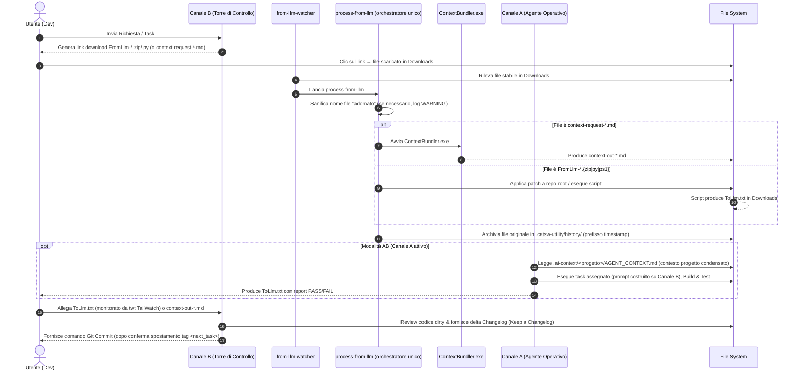

# TurboAI - Governance Agentica Multi-Canale & Automazione Locale

## 1. Obiettivo e Principi Guida

`TurboAI` consente di lavorare in modalità agentica o semiagentica con risorse limitate. Anche avendo a disposizione llm free tier o abbonamenti base con rate-limit severi.
Evolve il flusso agentico a una piattaforma multi-canale agnostica e totalmente segregata. Il principio guida rimane invariato:

> Utilizzo di un canale di assistenza al Governo anche in presenza di un canale FullAgentic, per supervisione, controllo, pianificazione e limitazione dei consumi di badget sui canali costosi/limitati.
> Governare intensamente le decisioni rischiose; eseguire in batch e verificare meccanicamente ciò che è deterministico, reversibile e già autorizzato.

Target principali:
- Gestione flessibile su 3 Canali (A, B, C) per garantire operatività sia in ambiente ad alta capacità (ufficio/flat) sia in mobilità/casa (fallback rate-limit).
- Integrazione completa dei daemon locali: `from-llm-watcher`, `process-from-llm`, `switch-skill` e monitoraggio streaming `tailwatch` su `ToLlm.txt`.
- Totale segregazione AI Act: zero termini agentici in `Documentation/` o nei rilasci ufficiali di prodotto.
- TurboAI nasce per colmare il divario tra le chat LLM gratuite/limitate (senza esecuzione agentica autonoma) e i workflow full-agentic. È uno strumento di transizione: se in futuro modelli full-agentic diventeranno liberamente accessibili senza le restrizioni attuali, gran parte della ragion d'essere di TurboAI verrebbe meno.

### 1.1  Cosa fornisce TurboAI (e cosa no)

TurboAI fornisce l'infrastruttura di orchestrazione: watcher, tool, e la skill che spiega all'LLM cosa ha a disposizione e come interagire con l'utente. Non fornisce - e non può fornire in generale - le regole di dominio del tuo progetto specifico.

Per usarlo su un progetto reale devi aggiungere i tuoi file di governo: markdown che istruiscono l'LLM su stack, convenzioni e best practice che vuoi far rispettare (es. per un progetto .NET: preferenze su `ReadonlySpan<T>`, pattern Result invece di eccezioni, ecc.). Il template incluso è volutamente minimale - il valore aggiunto che ottieni dipende dal dettaglio che ci metti tu.

TurboAI non è "installa e dimentica": le skill vanno riviste quando cambiano i modelli LLM sottostanti, perché comportamenti e istruzioni ottimali possono cambiare da un modello all'altro.

### 1.2 TDM - TurboAI Development Method

TDM è il nome del metodo di sviluppo assistito da AI su cui si basa TurboAI: l'insieme di regole, ruoli e gate che governano come un LLM esegue lavoro reale su un progetto, mantenendo tracciabilità e controllo umano.

Il TDM è definito operativamente dalle sezioni seguenti di questo documento:

- **Canali di esecuzione** (§2): chi fa cosa tra Canale A (agentico), B (chat supervisionata), C (modelli limitati)
- **Classificazione del rischio R1-R4** (§4): quanto controllo richiede un task prima di essere eseguito
- **Gate di governance** (§5): i punti di verifica obbligatori nel ciclo di lavoro

TDM non è un prodotto separato da installare: è la metodologia che i tool di TurboAI (watcher, orchestratore, skill) sono costruiti per far rispettare.

### 1.3 Artefatti di Piano e Contesto

- **SOLUTION_GOVERNANCE.md**: file principale di governo del canale B
- **Plan / Milestone / Task**: il lavoro è strutturato in piani suddivisi in milestone, a loro volta suddivise in task di dimensione contenuta, ciascuno eseguibile in una singola sessione di chat.
- **Agentic-Context**: file di contesto statico per-progetto che riduce il consumo di token del Canale A full-agentic, evitandogli di dover ricostruire da zero la comprensione della solution a ogni sessione.
- **Changelog**: il suo aggiornamento viene tipicamente delegato al Canale C (modelli più leggeri free), per non consumare i token limitati dei Canali B/A su un'attività a basso rischio.
- **Documentazione di progetto**: nei progetti della solution, i documenti markdown in `Documentation/` tipicamente delegati al Canale C (modelli più leggeri free)

Nota: La suddivisione di cosa fare sui canali è fortemente dipendente dalle risorse disponibili all'utente. Quello indicato è nel mio contesto attuale per lo sviluppo dei miei progetti personali con risorse free-tier.
Esempio al 2026-08-09:

- Canale A (full-agentic) : Google Antigravity 2.0 - free-tier con risorse limitate.
- Canale B (chat llm full capabiltiy for TDM use) : Anthropic Claude Sonnet 5.0, SpaceAI Grok 4.5
- Canale C (chat llm with limitation - can't download zip/py/md) : Gemini 3.6 Flash, ... lunga lista di altri modelli.

### 1.4 Curiosità

- il prefisso turbo, almeno nella fase iniziale, corrisponde al suo sviluppo turbo-lento (con modifiche turbinose, turbo-ai viene rivoluzionato a distanza di pochi giorni e -lento perchè lo sviluppo nei fine settimana e tarde serate nei ritagli di tempo, con i fondi di energie residue).
- il sitema turbo-ai è implementato nei laboratori CatSW di Roma su mainframe HAL9000-MK2 per la versione Windows 11 e sono previsti anche test sul server HAL9000 (MK1 del 2009) per i test su future release su Debian 13 (maybe).
- turbo-ai usa tecniche di dogfooding (ogm free).
- turbo-ai entro il 2171 diventerà senziente e salverà il mondo.
- la versione 42 di turbo-ai sarà in grado di svelare la "domanda fondamentale sulla vita, l'universo e tutto quanto" ma in file binario crittografato a prova di sistemi quantici.
- qualcuno afferma che CatSW significhi "Computer Automated Tools & Software Works" a me sembra più software del Caz.o (gatto)
- IK0VCK è il nominativo internazionale dell'operatore Stefano che ha stazione nel suo QRA di Roma ( sia lodata la telegrafia `... . -- .--. .-. .   ... .. .-   .-.. --- -.. .- - .-` )
- In CatSW la serietà è presa nella massima considerazione.

---

## 2. Architettura dei Canali (A, B, C)

`TurboAI` struttura il lavoro su tre canali distinti:

- **Canale A (Piena capacità Agentica autonoma con suo harness) - tipicamente risorse di utilizzo limitate ed a pagamento:**
  - Opera sul codice sorgente C# e sui file di progetto (`.csproj`).
  - Esegue build e unit test locali.
  - Legge e aggiorna lo stato temporaneo in `.ai-context/canale-a/<progetto>/` scrivendo solo il delta del task eseguito in formato https://keepachangelog.com/it-IT/1.1.0/.
  - **Divieti:** Non modifica mai file in `Documentation/`, `Changelog.md` o file di Piano; non committa e non esegue cleanup.

- **Canale B (Chat LLM evoluta - Torre di Controllo Flat / Primary) - risorse di utilizzo limitate o che richiedono pagamento per utilizzo intensivo:**
  - Utilizzato come canale principale ad alta quota/flat.
  - Classifica il rischio (R1-R4), acquisisce il contesto e definisce lo scope.
  - Revisiona il codice in stato *dirty* e i report del Canale A.
  - Applica il frammento Changelog in `Documentation/Changelog.md` ed esegue il commit finale.

- **Canale C (Chat LLM basica - Torre di Controllo Fallback) - non hanno le capability del canale B ma sono gratuite:**
  - Utilizzato da remoto/casa per superare i limiti di quota dei modelli primari sul canale B.
  - Sostituisce il Canale B nelle sessioni limitate, da utilizzare per compiti semplici per non consumare token sul canale B.

Con TurboAI gli scenari tipici sono due:

- Ambito lavorativo: si usa una combinazione di Canale A e B. Si usa il canale A per i compiti più complessi e delicati ed il canale B come ausilio al governo, brainstorming e fallback del canale A per risparmiarne il consumo.
- Ambito personale lo cost: si può lavorare anche senza pagare abbonamenti sfruttando solo Canale B e C. Il canale B (ad esempio Claude Sonnet e Grok) ha la possibilità di utilizzare al 100% TurboAI ma se si usa il free tier ha limitazioni forti di consumo token prima di incorrere in sospensioni di ore prima di poter tornare a lavorare. Chiaramente anche i modelli che si possono scegliere sono limitati rispetto ai tier a pagamento. Il canale C ha capacità limitate e modelli meno performanti del livello B (anche del B free tier) ma si usa per ovviare alle risorse limitate sul canale B, chiaramente se uno ha un abbonamento flat sul canale B il canale C può giusto servire in casi particolari.

---
### 3. Diagrammi

### 3.1 Diagramma di Sequenza Multi-Canale (A - B/C - Watcher)

### 3.2 Diagramma di Flusso della Selezione Skill e Fallback

---

## 4. Classificazione del Rischio (R1 - R4)

- **R1 (Basso rischio, meccanico):** Rename, movimento file, aggiornamento doc. Verifiche: diff e statici.
- **R2 (Rischio medio, refactoring circoscritto):** Estrazione classi, DI locale, utility. Verifiche: build e test mirati.
- **R3 (Alto rischio, comportamento o stato globale):** Auth, middleware, logging globale, DB, contratti. Richiede: assessment B1/C, guardrail, build, test suite e closure audit.
- **R4 (Critico, architetturalmente irreversibile):** Migrazione dati, contratti pubblici, sicurezza. Richiede: tutto R3 + checkpoint umano e rollback esplicito.

---

## 5. I Quattro Gate di Governance

1. **Gate 1 - Preflight:** Verificata pulizia working tree, HEAD, assenza file temporanei e baseline test.
2. **Gate 2 - Piano Operativo:** Definizione rischio (R1-R4), scope positivo/negativo, asserzioni e commit boundary.
3. **Gate 3 - Execution Gate:** Esecuzione in batch della patch, diff, build e test mirati. Stop immediato in caso di errore o deviazione.
4. **Gate 4 - Closure:** Verifiche, Aggiornamento Changelog e dei file in .ai-context di governo, commit gestito dalla Torre di Controllo (B/C).

---

## 6. Conformità AI Act & Segregazione Documentale

- **Zero Riferimenti AI:** `Documentation/`, `Changelog.md` e i `README.md` di prodotto devono rimanere completamente privi di riferimenti ad agenti, prompt o modelli LLM.
- **Ubicazione Metadati:** Tutti i file temporanei e i contesti agentici vivono sotto `.ai-context/`.
- **Esclusione Hash Commit:** Nessun documento tracciato da Git contiene l'hash del commit che lo introduce.

## 8. Governance Legale, Licenza & Open Source Compliance

### 8.0 Genesi del Progetto

TurboAI è stato progettato e sviluppato interamente su infrastruttura e tempo personali dell'autore (weekend, serate), come progetto indipendente, precedente e indipendente da qualsiasi incarico lavorativo specifico.

### 8.1 Licenza

`TurboAI` è pubblicato come software Open Source sotto **Licenza MIT**.

### 8.2 Copyright

La proprietà intellettuale dell'architettura e degli strumenti: Stefano Vesco (IK0VCK - CatSW).

### 8.3 Disclaimers

- **Separazione Netta tra Framework e Target Code:**
  - `TurboAI` costituisce un'infrastruttura di supporto isolata e generica.
  - L'applicazione della suite su progetti commerciali/aziendali non altera la licenza dei progetti stessi, poiché tutti i metadati di governance risiedono nella cartella temporanea e non distribuita `.ai-context/`.
- **Clausola di Manleva:** L'uso degli agenti di esecuzione e dei watcher è a discrezione e rischio dell'utente, coperto dalla clausola "AS IS" della licenza MIT.
