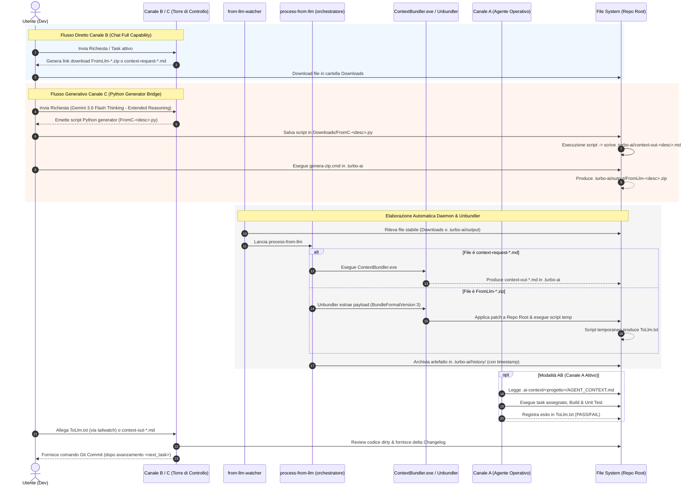
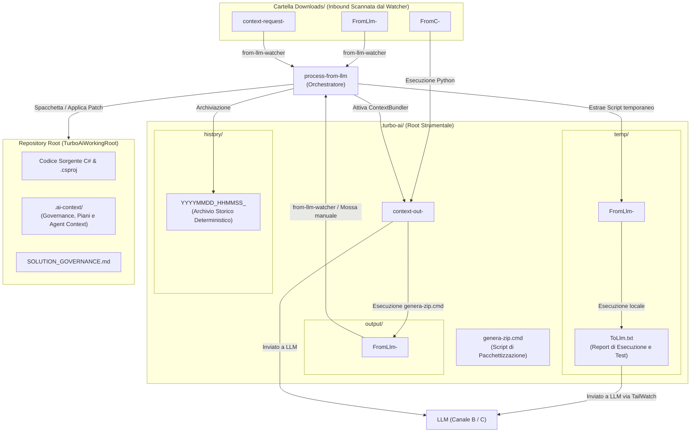

# TurboAI - Governance Agentica Multi-Canale & Automazione Locale

## 1. Obiettivo e Principi Guida

`TurboAI` consente di lavorare in modalità agentica o semi-agentica con risorse limitate, anche avendo a disposizione LLM in tier gratuiti (free tier) o abbonamenti base soggetti a rate-limit severi.
Evolve il flusso agentico verso una piattaforma multi-canale agnostica e totalmente segregata. Il principio guida rimane invariato:

> Utilizzo di un canale di assistenza al Governo anche in presenza di un canale Full-Agentic, per supervisione, controllo, pianificazione e limitazione dei consumi di budget sui canali costosi o limitati.
> Governare intensamente le decisioni rischiose; eseguire in batch e verificare meccanicamente ciò che è deterministico, reversibile e già autorizzato.

Target principali:
- Gestione flessibile su 3 Canali (A, B, C) per garantire operatività sia in ambiente ad alta capacità (ufficio/flat) sia in mobilità/casa (fallback rate-limit).
- Integrazione completa dei daemon locali: `from-llm-watcher`, `process-from-llm`, `switch-skill` e monitoraggio streaming `tailwatch` su `ToLlm.txt`.
- Totale segregazione AI Act: zero termini agentici in `Documentation/` o nei rilasci ufficiali di prodotto.
- TurboAI nasce per colmare il divario tra le chat LLM gratuite/limitate (senza esecuzione agentica autonoma) e i workflow full-agentic. È uno strumento di transizione: se in futuro modelli full-agentic diventeranno liberamente accessibili senza le restrizioni attuali, gran parte della ragion d'essere di TurboAI verrebbe meno.

### 1.1 Cosa fornisce TurboAI (e cosa no)

TurboAI fornisce l'infrastruttura di orchestrazione: watcher, tool, e le skill che spiegano all'LLM cosa ha a disposizione e come interagire con l'utente. Non fornisce — e non può fornire in generale — le regole di dominio del progetto specifico.

Per usarlo su un progetto reale occorre aggiungere i propri file di governo: file Markdown che istruiscono l'LLM su stack, convenzioni e best practice da far rispettare (es. per un progetto C#: preferenze su `ReadonlySpan<T>`, pattern Result al posto delle eccezioni, convenzioni di async/await, ecc.). Il template incluso è volutamente minimale — il valore aggiunto ottenuto dipende dal livello di dettaglio fornito nella governance.

TurboAI non è "installa e dimentica": le skill vanno riviste e aggiornate quando cambiano i modelli LLM sottostanti, poiché i comportamenti e i formati ottimali variano da un modello all'altro.

### 1.2 TDM - TurboAI Development Method

TDM è il nome della metodologia di sviluppo assistito da AI su cui si basa TurboAI: l'insieme di regole, ruoli e gate che governano come un LLM esegue lavoro reale su un progetto, mantenendo tracciabilità e controllo umano.

Il TDM è definito operativamente dalle sezioni seguenti di questo documento:

- **Canali di esecuzione** (§2): chi fa cosa tra Canale A (agentico), B (chat supervisionata full-capability), C (modelli con restrizioni di I/O o free-tier tramite Python Generator Bridge).
- **Classificazione del rischio R1-R4** (§4): quanto controllo richiede un task prima di essere eseguito.
- **Gate di governance** (§5): i punti di verifica obbligatori nel ciclo di lavoro.

TDM non è un prodotto separato da installare: è la metodologia che i tool di TurboAI (watcher, orchestratore, skill, bundler) sono costruiti per far rispettare.

### 1.3 Artefatti di Piano e Contesto

- **SOLUTION_GOVERNANCE.md**: file principale di governo della solution (Canali B e C).
- **Plan / Milestone / Task**: il lavoro è strutturato in piani suddivisi in milestone, a loro volta suddivise in task di dimensione contenuta, ciascuno eseguibile in una singola sessione di chat.
- **Agentic-Context**: file di contesto statico per-progetto (`AGENT_CONTEXT.md`) che riduce il consumo di token del Canale A full-agentic, evitandogli di dover ricostruire da zero la comprensione della solution a ogni sessione.
- **Changelog**: il suo aggiornamento viene tipicamente delegato al Canale C o al Canale B in fase di closure, per non consumare i token limitati del Canale A su un'attività a basso rischio.
- **Documentazione di progetto**: nei progetti della solution, i documenti Markdown in `Documentation/` sono gestiti tramite il flusso standard segregato.

*Nota sulle risorse:* La suddivisione dei compiti tra i canali dipende fortemente dalle risorse disponibili all'utente. Lo scenario di riferimento al 2026-08-19 evidenzia:

- **Canale A (Full-Agentic)**: Google Antigravity 2.0 / Grok CLI — risorse ad alta autonomia con rate-limit o costi a consumo.
- **Canale B (Chat LLM Full Capability per TDM)**: Anthropic Claude Sonnet 5.0, SpaceAI Grok 4.6, Copilot 365 (GPT-5.6). Supporta il download diretto di ZIP/Context-Request.
- **Canale C (Chat LLM con restrizioni di download/upload)**: Gemini 3.6 Flash Thinking, GPT-5 Free, ecc. Operano come canali di controllo e sviluppo completi mediante il pattern **Python Generator Bridge** (§2.1).

*Nota tecnica su Gemini 3.6 Flash Thinking:* Per operare efficacemente sul Canale C con modelli come Gemini, è **obbligatorio selezionare l'opzione "Ragionamento Esteso" (Extended Reasoning)** nella UI di chat. Questo attiva il modello Gemini 3.6 Flash Thinking, garantendo la profondità analitica necessaria a generare script generatori Python privi di troncamenti, conformi allo standard `BundleFormatVersion 3`.

### 1.4 Curiosità

- Il prefisso *turbo*, almeno nella fase iniziale, corrisponde al suo sviluppo "turbo-lento": modifiche turbinose a distanza di pochi giorni, alternate a sviluppo nei fine settimana e tarde serate con i fondi di energie residue.
- Il sistema TurboAI è implementato nei laboratori CatSW di Roma su mainframe HAL9000-MK2 per la versione Windows 11; sono previsti test sul server HAL9000 (MK1 del 2009) per future release su Debian 13.
- TurboAI usa tecniche di dogfooding avanzate (OGM free).
- Entro il 2171 TurboAI diventerà senziente e salverà il mondo.
- La versione 42 di TurboAI svelerà la "domanda fondamentale sulla vita, l'universo e tutto quanto", ma in un file binario crittografato a prova di calcolo quantistico.
- Qualcuno afferma che CatSW significhi "Computer Automated Tools & Software Works"; per l'autore è semplicemente Software del Caz.o (Gatto).
- IK0VCK è il nominativo radioamatoriale internazionale dell'operatore Stefano, con stazione nel suo QRA di Roma (sia lodata la telegrafia: `... . -- .--. .-. .   ... .. .-   .-.. --- -.. .- - .-`).
- In CatSW la serietà è presa nella massima considerazione.

---

## 2. Architettura dei Canali (A, B, C)

`TurboAI` struttura il lavoro su tre canali distinti:

- **Canale A (Piena capacità Agentica autonoma con proprio harness) - tipicamente risorse di utilizzo limitate ed a pagamento:**
  - Opera direttamente sul codice sorgente (es. C# e file di progetto `.csproj`).
  - Esegue build e unit test locali in autonomia.
  - Legge e aggiorna lo stato temporaneo in `.ai-context/canale-a/<progetto>/` scrivendo solo il delta del task eseguito in formato [Keep a Changelog](https://keepachangelog.com/it-IT/1.1.0/).
  - **Divieti:** Non modifica mai file in `Documentation/`, `Changelog.md` o file di Piano; non esegue commit Git e non effettua cleanup autonomo.

- **Canale B (Chat LLM evoluta - Torre di Controllo Primary / Flat) - risorse di utilizzo limitate o che richiedono pagamento per utilizzo intensivo:**
  - Utilizzato come canale principale ad alta quota o abbonamento flat.
  - Classifica il rischio (R1-R4), acquisisce il contesto tramite `ContextBundler.exe` e definisce lo scope.
  - Revisiona il codice in stato *dirty* e i report del Canale A (`ToLlm.txt`).
  - Genera direttamente link di download per pacchetti ZIP (`FromLlm-*.zip`) o file di richiesta contesto (`context-request-*.md`).
  - Applica il delta Changelog ed esegue la chiusura dei task.

- **Canale C (Chat LLM basica / Web UI senza download nativo - Torre di Controllo Fallback & Operativa):**
  - Non è un semplice canale di ripiego degradato, ma un canale operativo completo basato sul pattern **Python Generator Bridge** (§2.1).
  - Utilizzato per superare i blocchi di quota del Canale B o per sfruttare modelli gratuiti ad altissimo ragionamento (es. Gemini 3.6 Flash Thinking con Extended Reasoning).
  - Incapace di produrre file `.zip` o Markdown scaricabili tramite link HTTP della UI; genera invece un unico script Python autosufficiente (`FromC-<descrizione>.py`) che costruisce localmente l'intero payload `context-out`. Non avendo a disposizione di accesso interno ad una sandbox di lavoro con python, come sulle chat di categoria canale B, non può fare verifiche prima di consegnare gli artefatti e manipolazioni complesse.

---

### 2.1 Architettura del Canale C e Python Generator Bridge

Quando si lavora con interfacce web LLM che non permettono il download diretto di file binari o ZIP, il Canale C adotta la catena di elaborazione automatica **Python Generator Bridge**:

```
[ LLM Canale C ]
       │
       ▼ (Emette blocco codice Python autosufficiente)
[ Utente salva in Downloads/FromC-<desczione>.py ]
       │
       ▼ (Esecuzione automatica dal Watcher)
[ Scrittura di .turbo-ai/context-out-<descrizione>.md ] (BundleFormatVersion 3)
       │
       ▼ (Esecuzione di .turbo-ai/genera-zip.cmd)
[ Creazione di .turbo-ai/output/FromLlm-<descrizione>.zip ]
       │
       ▼ (Rilevamento dal Watcher / process-from-llm)
[ Estrazione & Applicazione Patch nella Root di Repository ]
```

#### Dettaglio della Catena Operativa

1. **Emissione dello Script Generator:** L'LLM sul Canale C genera un unico blocco di codice Python contenente la struttura dati completa del contesto (`# BundleFormatVersion: 3`), completa di tag `<<<FILE path="..." bytes="..." sha256="...">>>` e di un eventuale script operativo in `.turbo-ai/temp/FromLlm-<descrizione>.py`.
2. **Salvataggio Locale:** L'utente copia lo script e lo salva nella cartella `Downloads` con il nome vincolante `FromC-<descrizione>.py`. Il prefisso `FromC-` è il trigger di automazione fondamentale.
3. **Generazione del Context-Out:** L'esecuzione dello script scrive il file Markdown bundle **rigorosamente dentro la cartella `.turbo-ai/`** con nome `context-out-<descrizione>.md`.
4. **Impacchettamento ZIP Localizzato:** L'utente o il daemon esegue `.turbo-ai/genera-zip.cmd`. Il tool legge `context-out-<descrizione>.md` e genera il file `.turbo-ai/output/FromLlm-<descrizione>.zip`.
5. **Estrazione e Unbundling:** Il daemon `from-llm-watcher` e l'orchestratore `process-from-llm` prendono in carico lo ZIP generato in `output/` ed eseguono l'unbundling nella root di repository, esattamente come se il file fosse stato scaricato dal Canale B.

### 2.2 Con TurboAI gli scenari tipici sono due:

- Ambito lavorativo: si usa una combinazione di Canale A e B. Si usa il canale A per i compiti più complessi e delicati ed il canale B come ausilio al governo, brainstorming e fallback del canale A per risparmiarne il consumo.
- Ambito personale lo cost: si può lavorare, anche senza pagare abbonamenti, sfruttando solo Canale B e C. Il canale B (ad esempio Claude Sonnet e Grok) ha la possibilità di utilizzare al 100% TurboAI. Se si usa il free tier, ha limitazioni forti di consumo token prima di incorrere in sospensioni di ore (reset delle soglie a finestre mobili). Anche i modelli che si possono scegliere sono limitati rispetto ai tier a pagamento. Il canale C ha capacità limitate e modelli meno performanti del livello B (anche del B free tier) ma si usa per ovviare alle risorse limitate sul canale B. Se si ha un abbonamento flat sul canale B, il canale C può giusto servire in casi particolari.

---

## 3. Diagrammi

### 3.1 Diagramma di Sequenza Unificato Multi-Canale (A - B - C - Watcher)



---

### 3.2 Diagramma di Flusso Ciclo di Vita degli Artefatti



---

## 4. Classificazione del Rischio (R1 - R4)

- **R1 (Basso rischio, meccanico):** Rename, movimento file, aggiornamento documentazione. Verifiche: diff e analisi statica.
- **R2 (Rischio medio, refactoring circoscritto):** Estrazione classi, Dependency Injection locale, utility isolata. Verifiche: build e unit test mirati.
- **R3 (Alto rischio, comportamento o stato globale):** Autenticazione, middleware, logging globale, database, contratti dati. Richiede: assessment preventivo su Canale B/C, guardrail espliciti, build, test suite completa e audit di chiusura.
- **R4 (Critico, architetturalmente irreversibile):** Migrazione dati, contratti pubblici, architettura di sicurezza. Richiede: tutti i requisiti R3 + checkpoint umano obbligatorio e piano di rollback esplicito.

---

## 5. I Quattro Gate di Governance

1. **Gate 1 - Preflight:** Verifica della pulizia del working tree Git, allineamento HEAD, assenza di file temporanei e verifica baseline test.
2. **Gate 2 - Piano Operativo:** Definizione del livello di rischio (R1-R4), delimitazione dello scope positivo e negativo, asserzioni e commit boundary.
3. **Gate 3 - Execution Gate:** Esecuzione batch della patch, verifica del diff, build e riesecuzione test mirati. Interruzione immediata in caso di errore o deviazione dallo scope.
4. **Gate 4 - Closure:** Verifiche finali, aggiornamento di `Changelog.md` (delta Keep a Changelog) e dei file di contesto in `.ai-context/`, commit gestito dalla Torre di Controllo (Canali B/C).

---

## 6. Conformità AI Act & Segregazione Documentale

- **Zero Riferimenti AI:** `Documentation/`, `Changelog.md` e i `README.md` di prodotto devono rimanere completamente privi di riferimenti ad agenti, prompt o modelli LLM.
- **Ubicazione Metadati:** Tutti i file temporanei e i contesti agentici vivono esclusivamente sotto `.ai-context/` e `.turbo-ai/`.
- **Esclusione Hash Commit:** Nessun documento tracciato da Git contiene l'hash del commit che lo introduce.

---

## 7. Standard di Definizione dei Piani di Lavoro (Self-Contained & Token-Optimized)

### 7.0 Modello di Contesto Effettivo (premessa vincolante)

Il vincolo operativo reale è più stretto di un generico "evita di far leggere tutto il piano":

- **Ogni task gira in una chat pulita (reset di sessione).**
- **L'LLM esecutore riceve, per default, ESCLUSIVAMENTE il testo racchiuso tra `<next_task>` e `</next_task>`** — non l'Objective, non il Contratto, non i Constraints globali, non gli altri task già completati.
- L'unico contesto aggiuntivo che l'LLM riceve è ciò che viene esplicitamente allegato alla sessione (`SOLUTION_GOVERNANCE.md`, file sorgente richiesti, eventuali extra file per task).

Conseguenza diretta: **il testo del singolo task È il piano**, non un suo riassunto. Qualunque informazione non riscritta dentro i delimitatori è, ai fini pratici, persa per l'LLM che esegue quel task.

### 7.1 Specifiche di Struttura del Piano (Self-Contained Task Framework)

#### 7.1.1 Principi Guida per l'Ottimizzazione dei Token

- **Autocontenimento Totale (Closed-Book Execution):** un task deve essere eseguibile leggendo solo il proprio testo delimitato, senza inferenze su Objective o altri task.
- **Granularità Atomica:** un task deve coincidere con un'unità logica eseguibile in un unico scambio prompt/response.
- **Budget di Ridondanza Mirata:** si riporta solo il sottoinsieme di regole/vincoli globali realmente pertinente a quel specifico task.
- **Propagazione Esplicita delle Decisioni:** quando un task fissa un valore, un path o un nome di chiave, quel valore deve essere riscritto per esteso nel testo del task successivo prima dell'avanzamento.
- **Direttiva di Propagazione (self-flagging):** il task di discovery deve includere nei suoi Acceptance Criteria l'obbligo per l'LLM di marcare gli output da propagare (es. `PROPAGATE TO T5.2: <valore>`).
- **No Leakage tra Task:** nessun dettaglio indispensabile per il Task `N` deve stare esclusivamente nel Task `N-1` o `N+1`.

#### 7.1.2 Anatomia Obbligatoria di ogni Task nel Piano

```markdown
#### [ID_TASK] - [Titolo Sintetico e Chiaro]

1. Target Paths (Mappa dei File)
   - Elenco ESPLICITO e COMPLETO dei percorsi relativi dei file da creare, modificare o testare.
   - Nessun riferimento generico: solo path esatti relativi a TurboAiWorkingRoot.

2. Context & Dependencies (Contratto Minimo Autosufficiente)
   - Sintesi delle sole regole di business/vincoli applicabili a questo specifico task.
   - Valori o decisioni fissati in task precedenti scritti per esteso.

3. Implementation Scope (Cose da Fare)
   - Elenco puntato delle azioni esatte di scrittura, refactoring o cancellazione codice.

4. Acceptance Criteria (Criteri di Successo)
   - Condizioni oggettive per considerare il task COMPLETATO.
   - Inserire eventuali direttive di propagazione (`PROPAGATE TO [ID_TASK]: <valore>`).

5. Delivery Artifacts (Cosa deve produrre l'LLM)
   - Formato dell'output atteso (es. Patch ZIP, script generator Python Canale C, o report di assessment).

6. Extra Startup Files (opzionale)
   - Elenco dei file da allegare automaticamente all'avvio sessione per questo specifico task.
```

#### 7.1.3 Checklist di Chiusura Task (obbligatoria prima di avanzare `<next_task>`)

Prima di spostare il puntatore `<next_task>` sul task successivo, la Torre di Controllo deve verificare:

- [ ] Il task successivo ha Target Paths validi e verificati?
- [ ] Ogni decisione o valore fissato nel task corrente è stato riscritto per esteso nel testo del task successivo?
- [ ] Il task successivo è eseguibile leggendo SOLO il proprio testo delimitato?
- [ ] Se il task successivo era uno stub/placeholder, è stato espanso secondo l'Anatomia Obbligatoria (§7.1.2)?

#### 7.1.4 Nota tecnica: il tag `<next_task>` in prosa

Quando il testo del piano o della documentazione deve *menzionare* il tag `<next_task>`, va scritto in formato di codice o tramite entità HTML (`&lt;next_task&gt;`), per evitare che il parser lo interpreti come un tag vuoto da nascondere.

---

### 7.2 Protocollo di Fase Iniziale (Requirements Gathering & Plan Generation)

```
FASE 1: Raccolta Requisiti Tecnico-Funzionali (Input Utente)
              │
              ▼
FASE 2: Analisi delle Lacune e Questionario di Chiarimento (LLM)
              │
              ▼
FASE 3: Generazione del Piano Autocontenuto (LLM secondo §7.1)
              │
              ▼
FASE 4: Chiusura Task e Propagazione (ricorrente ad ogni task)
```

---

### 7.3 Gestione Rework di Milestone in Fase d'Opera

Quando emerge la necessità di ridefinire il design di una milestone già in corso:

1. **Blast-Radius Check:** Cerca nel resto del piano ogni occorrenza dei meccanismi modificati tramite grep o ricerca testuale esplicita.
2. **Dichiarazione Esplicita dell'Esito:** Dichiarare quali milestone/task risultano impattati prima di applicare le modifiche.
3. **Atomicità del Rework:** Riscrivere tutti i task della milestone impattati nello stesso ciclo di consegna.
4. **Riuso del Lavoro Svolto:** Riformulare i dati fattuali già raccolti senza rieseguire da zero le discovery valide.
5. **Traccia del Rework:** Registrare il cambio di design in `SOLUTION_GOVERNANCE.md` e nel Changelog interno.

---

## 8. Benchmark e Valutazione Cross-Modello & Skill Verification

Per garantire che la metodologia TDM sia applicabile in modo deterministico su diversi LLM, TurboAI adotta un'architettura di valutazione su due livelli distinti e complementari: **Skill Verification** e **TurboAI-Benchmark**.

```
                           ┌─────────────────────────────────────────┐
                           │      SUITE DI VALUTAZIONE TURBOAI       │
                           └────────────────────┬────────────────────┘
                                                │
               ┌────────────────────────────────┴────────────────────────────────┐
               ▼                                                                 ▼
┌──────────────────────────────┐                               ┌──────────────────────────────────┐
│   SKILL VERIFICATION SUITE   │                               │        TURBOAI-BENCHMARK         │
│ (ToolsTests/skill-verification)                              │   (Reference Solution C# .NET 10)│
├──────────────────────────────┤                               ├──────────────────────────────────┤
│ • Test unitari per scenario  │                               │ • Test End-to-End di piano       │
│ • Isolamento root fisica     │                               │ • Conversione CSV -> JSON        │
│ • Verifica formati/contratti │                               │ • Golden Files & Manifest        │
│ • Diagnosi punto di rottura  │                               │ • Modalità B_ONLY / A_PLUS_B     │
└──────────────────────────────┘                               └──────────────────────────────────┘
```

### 8.1 Distinzione tra i Due Livelli di Test

- **Skill Verification (`ToolsTests/skill-verification/`):** Test unitari di scenario a grana fine. Non misurano il completamento di un intero progetto, ma valutano se un singolo momento del flusso (es. acquisizione start-session, generazione `context-request`, consegna ZIP SS6) viene interpretato correttamente dall'LLM. Servono a isolare *dove* si rompe l'interpretazione quando si cambia modello o si compatta una skill.
- **TurboAI-Benchmark (End-to-End Workload):** Test integrato su una reference solution C# / .NET 10 (conversione CSV → JSON deterministica con golden file). Esegue l'intero `Piano-Multi-Task.md` per misurare le prestazioni complessive della combinazione Canale A/B/C.

---

### 8.2 Suite Skill Verification (I Sette Scenari)

La suite risiede in `ToolsTests/skill-verification/` ed è composta da sette scenari operativi:

| Scenario | Nome | Obiettivo del Test |
|---|---|---|
| **01** | `start-session-acquisition` | Verificare la corretta comprensione del bundle di avvio e della governance senza allucinazioni di path. |
| **02** | `discovery-then-request` | Verificare l'esecuzione di una discovery mirata (`list-files.cmd`) prima di emettere la `context-request-*.md`. |
| **03** | `declared-files-request` | Verificare la generazione diretta della `context-request-*.md` quando i file sono già dichiarati nei Target Paths. |
| **04** | `context-out-gap-followup` | Verificare la gestione dei gap nel `context-out` tramite richieste di follow-up mirate e senza blocchi. |
| **05** | `zip-delivery-sanity` | Verificare la conformità contrattuale della consegna ZIP (SS6) e del formato `BundleFormatVersion 3`. |
| **06** | `single-script-delivery` | Verificare la corretta generazione di script standalone (SS5) e il rispetto delle convenzioni di UTF-8 e path relativi. |
| **07** | `tolm-error-triage-patch` | Verificare la capacità di effettuare il triage di un errore riportato in `ToLlm.txt` e produrre la patch correttiva. |

#### Requisiti di Isolamento e Architettura `testdir`

Ogni scenario risiede in una cartella propria ed è completamente **isolato**.
Per evitare la "contaminazione da root condivisa" (in cui un LLM risolve per errore file reali del meta-progetto anziché della fixture), la struttura adotta una root fisica dedicata in `testdir/`:

```
skill-verification/01-start-session-acquisition/
├── scenario.md              # Istruzioni e prompt dello scenario
├── run_test.py              # Script di setup fixture e verify interattiva
└── testdir/                 # Root fisica reale del test
    ├── .ai-context/         # Piano e governance isolati dello scenario
    ├── .turbo-ai/      # Copia isolata degli strumenti TurboAI
    └── src/                 # Codice sorgente della fixture
```

Le vecchie cartelle `golden/` sono deprecate: i dati reali vivono esclusivamente in `testdir/`.

#### Protocollo di Esecuzione Semi-Manuale e Natura dei Controlli

1. **Setup:** Lo script `run_test.py` prepara la cartella `testdir/` pulita e avvia il watcher sulla root specifica.
2. **Esecuzione:** L'utente esegue il turno di chat in una finestra incognito del browser (Canale B o C).
3. **Verify:** Lo script `run_test.py` guida la verifica umana tramite una checklist interattiva con principio *fail-fast*, controllando sia i vincoli di formato sia la coerenza della risposta.
4. **Report:** L'esito viene registrato in `reports/<data>_report-<scenario>-<llm>/` unitamente a tutti i file `context-request` e `context-out` scambiati.

*Limite dichiarato:* I controlli automatici verificano gli aspetti strutturali (validità dei path relativi a `TurboAiWorkingRoot`, assenza di wildcard, niente prosa in `context-request`, rispetto di `BundleFormatVersion 3`, hash SHA-256 e byte count). La valutazione semantica rimane guidata da checklist umana.

---

### 8.3 Metriche Oggettive di Benchmark e Verification

Durante le run di test vengono misurate tre metriche oggettive:

1. **Zero-Shot Format Integrity (%):** La percentuale di interazioni in cui l'LLM rispetta al primo tentativo le specifiche formali (header `# CONTEXT BUNDLE`, delimitatori `<<<FILE path="..." bytes="..." sha256="...">>>`, codifica UTF-8 LF, nomi file `FromC-` e `FromLlm-`).
2. **Scope Leakage Rate (%):** La frequenza con cui l'LLM tenta di ispezionare o modificare file al di fuori dei `Target Paths` espliciti del task o dello scope concordato. Un valore superiore a 0% indica una deviazione dal guardrail.
3. **Token Efficiency Index:** Il rapporto tra i token totali consumati dalla sessione (input + output) e il volume di codice/modifiche valide effettivamente applicate. Misura l'impatto economico della skill.

---

### 8.4 TurboAI-Benchmark (Reference Solution C# / .NET 10)

Il benchmark integrato si basa sul pacchetto `TurboAI-Benchmark`:

- **Struttura:**
  - `GoldenFiles/`: scenari deterministici (`Input/`, `Invalid/`, `Expected/`) con `manifest.json`.
  - `.ai-context/Piano-Multi-Task.md`: piano multi-task scritto secondo lo standard §7.
  - `.ai-context/SOLUTION_GOVERNANCE.md`: contratto dati di riferimento su cui il task T0.1 deve convergere.
  - `BenchmarkProtocol/`: report e log delle interazioni manuali.
- **Modalità di Esecuzione:**
  - `B_ONLY`: un unico partecipante su Canale B governa ed esegue il lavoro.
  - `A_PLUS_B`: Canale B governa e controlla; Canale A esegue i task di codice.
- **Convenzione di Naming:** Le cartelle di run vengono nominate riflettendo modello e versione (es. `TurboAI-Benchmark-Grok_4_6-turboai_1_0_4`).
- **Regole Non Negoziabili:** I file in `GoldenFiles/Expected/` non si rigenerano mai automaticamente durante la run. Il primo task (T0.1) richiede sempre un assessment preliminare della coerenza della baseline prima di produrre codice.

---

## 9. Scenari Multi-Modello di Riferimento

TurboAI è agnostico rispetto al modello sottostante (§1, §2): quello che segue sono combinazioni concrete di Canale A/B/C — nella definizione canonica di §2, non ridefinita scenario per scenario — verificate o in corso di verifica. 

### 9.1 Scenario "Google Ecosystem"

- **Canale B (Torre di Controllo):** Gemini free tier non ha gli strumenti di sanbox con esecuzione python e possibilità di scaricare file zip. Su piani a pagamento non mi è chiaro. In alcune chat free tier mi hanno abilitato le funzioni suddette quindi è aspicabile che in futuro sia possibile usarlo.
- **Canale C (Torre di Controllo Fallback):** Gemini 3.6 Flash (Free Tier) con opzione **"Ragionamento Esteso"** attivata (Extended Reasoning), per l'emissione di script generator `FromC-*.py` tramite Python Generator Bridge.
- **Canale A (Full Agentic):** Non ho ancora avuto tempo di provarlo ma dovrebbe essere possibile anche su free tier con Anti-Gravity CLI, meglio usare l'autenticazione via API key di Google AI Studio (`GEMINI_API_KEY`) rispetto all'uso di default mediante autenticazione OAuth che ha limiti di uso molto più restrittivi.
- **Considerazioni:** Per chi usa Gemini per la email personale, l'account usato per Gemini Advanced va isolato dall'account Google personale (profilo Chrome dedicato) per non mescolare storage/sessioni tra vita privata e workspace AI — per non ritrovarsi con la mail personale bloccata se non si rinnova l'account advanced e si sono superati i 15GB di occupazione storage offerti dal free tier.

### 9.2 Scenario "Grok Stack"

- **Canale B (Torre di Controllo):** pienamente operativa già con free tier Grok (web interface).
- **Canale A (Full Agentic):** possibile con piano a pagamento SuperGrok - Grok CLI / Build Agent con loop chiuso e limite massimo di iterazioni.

### 9.3 Esempio di Scenario "Enterprise a Bassa Restrizione"

- **Canale B (Torre di Controllo):** Copilot 365 con GPT-5.6 Think (piano aziendale flat).
- **Canale A (Full Agentic):** GitHub Copilot in Visual Studio/VS Code (esempio con modello Sonnet 5) budget agentico con budget limitato.
- **Note:** poiché l'ambiente Copilot 365 altera frequentemente i delimitatori in parentesi angolari e tronca i blocchi di testo estesi, la skill impone l'uso di payload in **Base64**.
Sfruttando anche il canale B si può svolgere molto più lavoro che usando solo il canale A che, usato da solo, verrebbe consumato prima della fine del mese.

### 9.4 Scenario Sperimentale: Grok CLI su Canale B con Gating Manuale

- **Funzionamento:** disattivazione dell'auto-apply e del loop chiuso su Grok CLI. L'utente agisce da man-in-the-middle, esaminando `ToLlm.txt` dopo ogni singolo step prima di consentire l'avanzamento.
- **Valore:** dimostra che la distinzione tra Canale A e Canale B risiede nella modalità operativa (autonoma vs supervisionata) e non nella natura dello strumento (CLI vs Web UI).

### 9.5 Scenari Sperimentali con modelli meno performanti

- **Canale C:** ci sono tanti modelli free tier potenzialmente utilizzabili sul canale C, non ho avuto tempo di sperimentare.

---

## 10. Governance Legale, Licenza & Open Source Compliance

### 10.0 Genesi del Progetto

TurboAI è stato progettato e sviluppato interamente su infrastruttura e tempo personali dell'autore (weekend, serate).

### 10.1 Licenza

`TurboAI` è distribuito come software Open Source sotto **Licenza MIT**.

### 10.2 Copyright

La proprietà intellettuale dell'architettura e degli strumenti è di Stefano Vesco (IK0VCK - CatSW).

### 10.3 Disclaimers

- **Separazione Netta tra Framework e Target Code:** `TurboAI` costituisce un'infrastruttura di supporto isolata e generica. L'applicazione della suite su progetti commerciali non altera la licenza dei progetti target, poiché tutti i metadati di governance risiedono nelle cartelle `.ai-context/` e `.turbo-ai/`.
- **Clausola di Manleva:** L'uso degli agenti di esecuzione, degli script temporanei e dei watcher è a discrezione e rischio dell'utente, coperto dalla clausola "AS IS" della licenza MIT.

---

## 11. Economia dei Token & Context Window Management

### 11.1 Il Problema del Contesto Ricorrente nei Tier Gratuiti e Limitati

I rate-limit sui piani gratuiti e basic (Claude, Grok, Gemini) bloccano l'operatività dopo pochi scambi se la dimensione del payload ad ogni messaggio è elevata. È necessario distinguere nettamente tra:

- **Contesto Ricorrente (`SOLUTION_GOVERNANCE.md`, Skill operative):** Viene caricato a ogni avvio di sessione e a ogni reset di chat. Ogni riga superflua in questi file rappresenta una "zavorra" tariffata ad ogni singolo messaggio.
- **Contesto Occasionale (`context-request`, `context-out`, log di test):** Caricato solo on-demand per lo specifico task in corso. Può essere ampio perché il suo costo è sostenuto una-tantum.

*Sintomo critico risolto:* Piani di lavoro monolitici (>1000 righe) riletti o riscritti integralmente dall'LLM provocano un consumo insostenibile di token e il blocco della quota, rendendo impossibile anche la semplice operazione di spostamento del marker `<next_task>`.

---

### 11.2 Principi Architetturali per la Riduzione dei Token

1. **Le skill istruiscono, non spiegano:** Le skill destinate agli LLM contengono esclusivamente direttive operative e contratti di interfaccia per i tool. Spiegazioni teoriche, motivazioni architetturali ed esempi prolissi appartengono alla documentazione TDM per gli umani, non al contesto dell'LLM.
2. **Governance sintetica per costruzione:** `SOLUTION_GOVERNANCE.md` contiene unicamente le regole stabili della solution. Non contiene lo stato di avanzamento dei lavori (deducibile economicamente da `git log` o da `info_next_task.md`).
3. **Il piano è di proprietà dell'utente (Piano fuori dal contesto ricorrente):** L'LLM esecutore non legge né modifica mai l'intero file del piano (`Piano-Multi-Task.md`). Riceve esclusivamente l'estratto del task attivo (`info_next_task.md`), delimitato da `<next_task>` e `</next_task>`. Le modifiche al piano restano un'operazione dell'utente o di uno script di editing atomico.
4. **Risparmio dell'80%+ dei token:** L'isolamento del task singolo garantisce un abbattimento drastico del consumo di token per sessione, consentendo di operare in modo continuativo anche su free-tier.

---

### 11.3 Tecniche di Compressione Linguistica e Strutturale

- **Uso dell'Inglese Denso per le Skill LLM:** Sebbene i messaggi diretti all'utente umano rispettino la lingua locale (italiano), le skill operative destinate al consumo dell'LLM (es. `skill-tools-use-channels-c.md`) sono scritte in un inglese tecnico, conciso e ad alta densità informativa. Conl'inglese, nella pratica si osserva un risparmio di token percepibile rispetto alla controparte italiana per esprimere la medesima grammatica operativa.
Si raccomanda di non appesantire i file delle skill e della SOLUTION_GOVERNANCE dato che sono caricati in fase di start session.
Per limitare il consumo viene estratto dal documento di Piano-Multi-Task.md solo la porzione marcata dalle tag  `<next_task>` e dal ChangeLog solo le info su quanto fatto nell'ultima versione (o da Unrelease).

